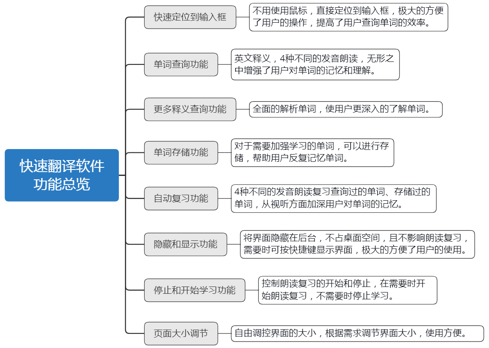
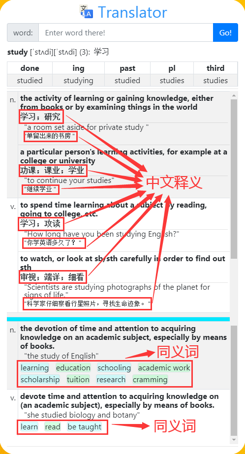
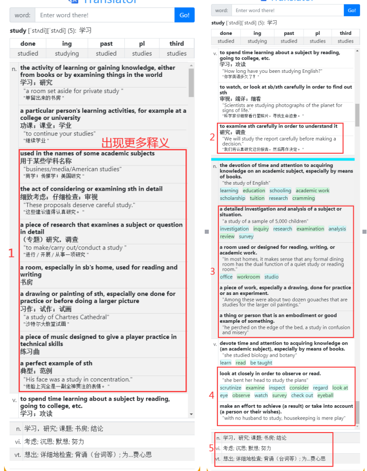

[![MIT License][license-shield]][license-url]


<br />
<p align="center">
  <a href="https://github.com/DaviesGit">
    
  </a>

  <h3 align="center">Maked by Davies</h3>

  <p align="center">
    Email: 1182176003@qq.com
<!--     <br />
    <a href="https://github.com/DaviesGit"><strong>Explore the docs »</strong></a>
    <br />
    <br />
    <a href="javascript:void(0)">View Demo</a>
    ·
    <a href="javascript:void(0)">Report Bug</a>
    ·
    <a href="javascript:void(0)">Request Feature</a> -->
  </p>
</p>


<!-- TABLE OF CONTENTS -->
## Table of Contents

* [About the Project](#about-the-project)
  * [Built With](#built-with)
* [Getting Started](#getting-started)
  * [Prerequisites](#prerequisites)
  * [Installation](#installation)
* [Usage](#usage)
* [功能定制](#功能定制)
* [Roadmap](#roadmap)
* [Contributing](#contributing)
* [License](#license)
* [Contact](#contact)
* [Acknowledgements](#acknowledgements)
* [免责声明](#免责声明)


<!-- ABOUT THE PROJECT -->
## About The Project

软件功能



软件主界面



全部意思展开后



Translator是我最早开始的一个项目了，目前这已经是第4个版本了，也是目前我在用的版本。做这个软件的初衷是想在看英文文档的时候更快的查询单词，而不用在各个软件之间切换，只用键盘就可以完成单词查询。同时这个软件在空闲的时候也可以帮助我在神不知鬼不觉的情况下的复习保存过的单词 `/哈哈哈` `/没想到吧`。它支持4种美式发音，4种英式发音，可以纠正我超级不标准的发音。目前它已经收录了多达4,676,953条单词和短语`/对，460多万，你没有看错`，词库大小超过了`90GB`，已经远远超过了托福雅思的词汇量。

> 完整的单词短语收录列表在`word_list.txt`中给出。

> 发行版中的数据库中收录了`62657`条单词和短语，共`3.6GB`。发行版单词短语列表在`word_list_dist.txt`中给出。注：为减小发行版体积，发行版中的发音只包含了两种美式发音。

发行版中默认保存了4级词汇，作为你平时复习的内容。你可以通过修改发行版中的`resources/Translator4.55.12/saved_words.json`文件进行设置。单词短语数据库位于`resources/database/data/`文件夹中。

软件功能:

* 快速查询单词（仅用键盘）
* 折叠不常用释意。
* 空闲复习。
* 多种发音。
* hackable。


单词查询功能：

* 可显示单词的多种时态包括被动语态、现在进行时、过去式、第三人称单数、派生词等。
* 支持英英翻译（英英结果也带有中文解释）。
* 每种意思带有相应的例句。
* 同义词、反义词。


项目结构：

```
project
├── Translator_configer     翻译器配置文件
├── Translator_crawler      词库爬虫
├── Translator_linux        翻译器linux版本（具有更多功能）
├── Translator_windows      翻译器windows版本
├── word_list_dist.txt      发行版词库列表
└── word_list.txt           完整词库列表
```

> Translator_linux拥有更多功能，比如`历史记录`、`随机单词学习`等功能。
>
>  词库爬虫使用方法请自行研究。仅供个人***学习***使用，不可用于其它意图。


发行版可以在[release页面](https://github.com/DaviesGit/translator/releases)下载。

### Built With
使用的库或技术
* [Electron | Build cross-platform desktop apps with JavaScript ...](https://www.electronjs.org/)
* [Node.js](https://nodejs.org/)
* [jQuery](https://jquery.com/)
*  [jquery_enhanced_ajax](https://github.com/DaviesGit/jquery_enhanced_ajax)
*  [Bootstrap · The most popular HTML, CSS, and JS library in the ...](https://getbootstrap.com/)
*  [gre/bezier-easing: cubic-bezier implementation for ...](https://github.com/gre/bezier-easing)
*  [SQLite Home Page](https://www.sqlite.org/)


<!-- GETTING STARTED -->

## Getting Started

这个章节将指导你简单的部署和使用该软件(注：以下部分只包含翻译器的Windows版本安装方法，linux版本和爬虫安装方法请自行研究)。

### Prerequisites

这个项目的依赖安装步骤在下面给出。
* [Electron | Build cross-platform desktop apps with JavaScript ...](https://www.electronjs.org/)
```sh
请下载并安装兼容你系统的electron发行版。
```

### Installation

1. 在[release页面](https://github.com/DaviesGit/translator/releases)下载最新版Windows安装包。
2. 解压压缩包到任意位置。


<!-- USAGE EXAMPLES -->
## Usage

1. 双击运行`Translator/Translator.exe`文件。
2. Enjoy.

> 软件详细使用说明请参考`使用说明.pdf`。


## 功能定制

如果需要功能定制，请联系作者 [1182176003@qq.com](1182176003@qq.com)


<!-- ROADMAP -->

## Roadmap

See the [open issues](https://example.com) for a list of proposed features (and known issues).


<!-- CONTRIBUTING -->
## Contributing

Contributions are what make the open source community such an amazing place to be learn, inspire, and create. Any contributions you make are **greatly appreciated**.

1. Fork the Project
2. Create your Feature Branch (`git checkout -b feature/AmazingFeature`)
3. Commit your Changes (`git commit -m 'Add some AmazingFeature'`)
4. Push to the Branch (`git push origin feature/AmazingFeature`)
5. Open a Pull Request


<!-- LICENSE -->
## License

Distributed under the MIT License. See `LICENSE` for more information.


<!-- CONTACT -->
## Contact

Davies - [@qq](1182176003) - 1182176003

Davies - [@email](1182176003@qq.com) - 1182176003@qq.com


<!-- ACKNOWLEDGEMENTS -->
## Acknowledgements
* [GitHub](https://github.com/)
* [Google](https://www.google.com/)


## 免责声明
* 该软件中所包含的部分内容，包括文字、图片、音频、视频、软件、代码、以及网页版式设计等可能来源于网上搜集。

* 该软件提供的内容仅用于个人学习、研究或欣赏，不可使用于商业和其它意图，一切关于该软件的不正当使用行为均与我们无关，亦不承担任何法律责任。使用该软件应遵守相关法律的规定，通过使用该软件随之而来的风险与我们无关，若使用不当，后果均由个人承担。

* 该软件不提供任何形式的保证。我们不保证内容的正确性与完整性。所有与使用该软件的直接风险均由用户承担。

* 如果您认为该软件中所包含的部分内容侵犯了您的权益，请及时通知我们，我们将尽快予以修正或删除。

<!-- MARKDOWN LINKS & IMAGES -->
<!-- https://www.markdownguide.org/basic-syntax/#reference-style-links -->

[license-shield]: readme_images/MIT_license.svg
[license-url]: https://opensource.org/licenses/MIT

[product-screenshot]: readme_images/screenshot.png
